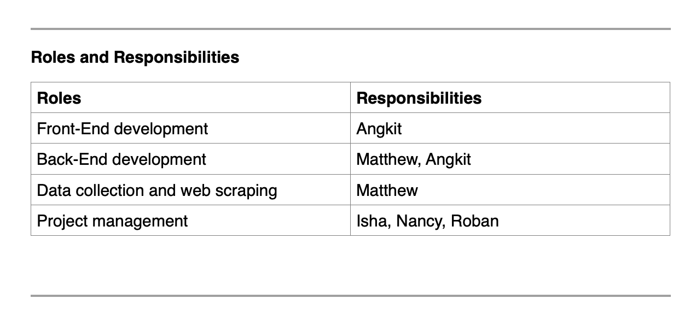
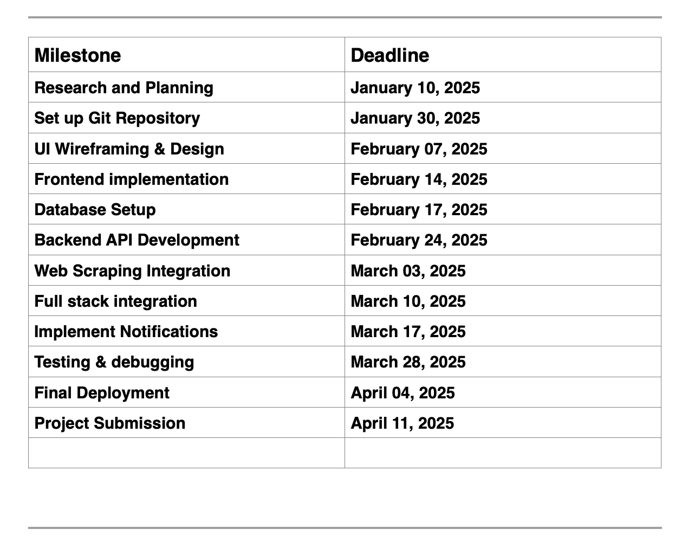
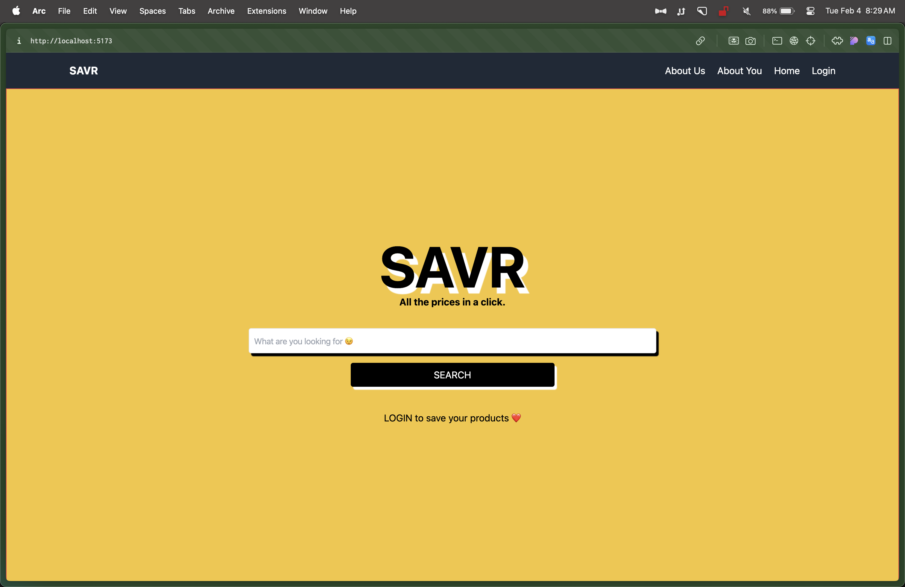
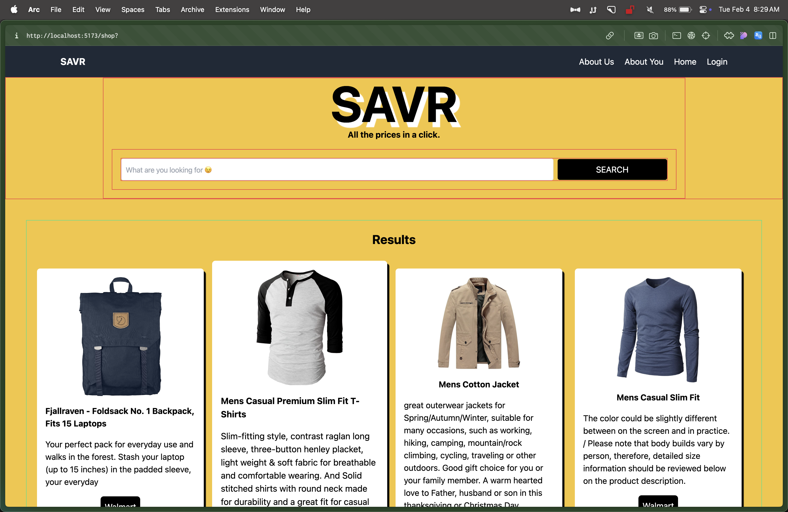

# Project: SAVR

# Project Goal

## Problem & Solution

Many people want to buy products but prefer to wait for a price drop. Money has become an important part of our lives in 2025. However, tracking prices manually across platforms like Amazon, Walmart, and Costco is time-consuming and frustrating. In the fast-paced lifestyle we have now, we need to find solutions that allow people to save their much valued time.

## Common Problems Shoppers Face:

- Price Changes Frequently: Customers miss out on the best deals due to unpredictable discounts.
- Forgetting Saved Items: Many add products to their carts but forget to check back.
- Lack of Notifications: Most platforms don’t alert users when prices drop.
- Overpaying for Products: Shoppers might pay more than necessary without price comparison.

## Our Solution – The Price-Matching App

**To solve this, our app will:**
#
- Compare prices across multiple retailers and give them the best value.
- Save items users are interested in.
- Notify them when the price drops.
- Help them shop smarter with real-time updates.

This app will simplify online shopping, ensuring users get the best deals without constant price-checking.

## Roles and Responsibilities

# Project Elements

## User Interface

- Home Page with product search functionality
- Product comparison table with historical price trends
- User registration & login

## Backend System

- Develop our own API logic to fetch and update prices from
- Amazon, Leons, Best Buy, Giant Tiger, Costco and other smaller retailers.
- Establish a NoSQL Database for storing product prices, users, and notification preferences

## Web Scraping & Data Integration

- Allow for fetching of product prices using third-party APIs or web scraping
- Updating the database with real-time price changes

## Notification System

- Email and SMS alerts for price drops
- User-defined notification preferences

## Security

- Proper authentication handling using various security libraries
- Proper user authorization depending on user roles
- System logging and accounting of critical activities
- Encryption of data in use, data at rest, and data in transit
- Implement proper input validation to prevent any form of code injection
- Secure the back-end server with proper authentication and communication encryption

## Milestones and Deadlines

# Potential Risks

#### Website Blocking Web Scrapers: Some platforms may block price-scraping attempts.

Mitigation: Use API access where available, rotate user agents and respect robots.txt.

#### Delayed Price Updates: Prices may change frequently, affecting accuracy.

Mitigation: Optimize web scraping frequency and use caching techniques.

#### Security Concerns: Handling user authentication securely.

Mitigation: Use OAuth or JWT authentication, HTTPS, and secure data encryption, Obfuscation of critical database entries.

#### Notification Delivery Issues: Emails might land in spam.

Mitigation: Implement verified SMTP services like SendGrid or AWS SES.

# Communication & Work Plan

#### Meetings:

Weekly team meetings every Tuesday at 12:15 PM In a student meeting Room, Sault College Toronto campus.
Mid-week check-ins on Slack.

#### Task Management:

Use Notion to track task assignments and progress.

#### Collaboration Tools:

GitHub for version control.
Google Docs for documentation.
Slack/WhatsApp for quick discussions.

# Sample Frontend

